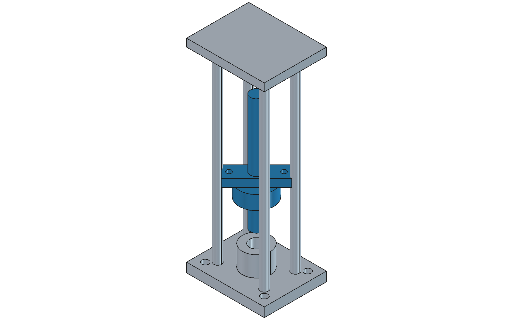
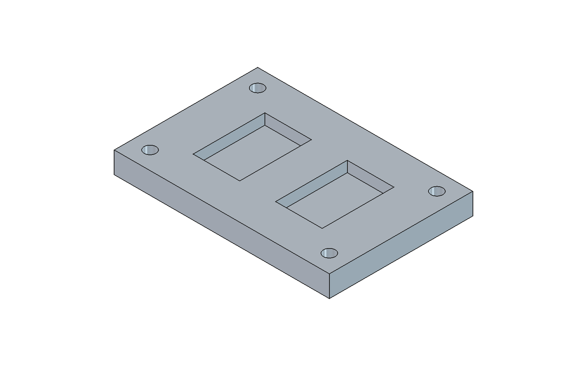
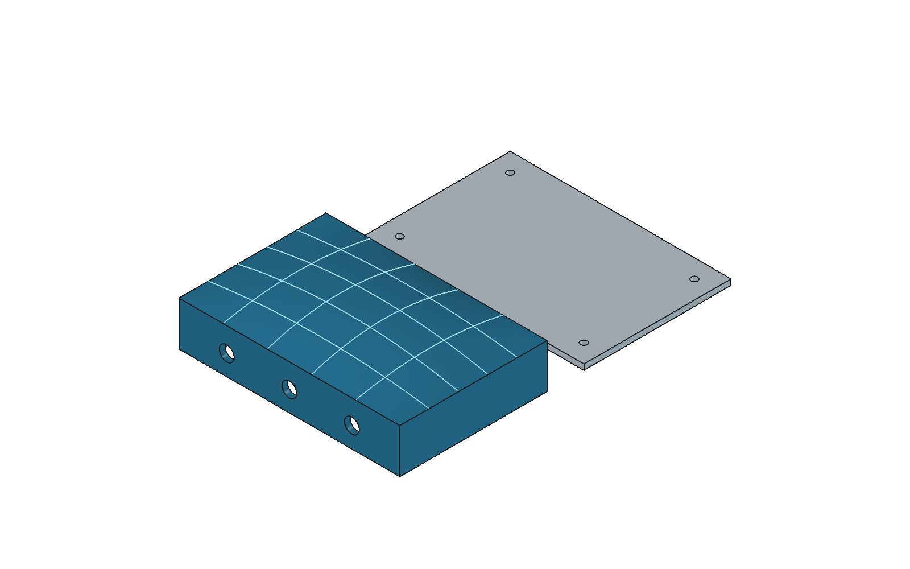

# FreeCAD Nexus

Connect AI assistants to FreeCAD through the Model Context Protocol (MCP) for modeling, assembly, machining workflows and surface editing. Geometry, assembly solving and toolpath generation use FreeCAD's native APIs.

## Features

| Module | Capabilities |
| --- | --- |
| Core modeling · 152 tools | Documents and objects, PartDesign, Draft, spreadsheets, import/export, views and screenshots, macros, Python execution and model checks. |
| Assembly · 67 tools | 13 joint types, native solving and diagnostics, rigid/flexible and nested instances, motion simulation, BOM/CSV, exploded views and ASMT export. |
| CAM/Path · 69 tools | 17 operation families, 10 dressup types, multiple tools, stock and workpiece setup, model replacement, path statistics, voxel stock removal, LinuxCNC postprocessing and setup reports. |
| Surface · 54 tools | BSpline/Bezier geometry, control points and weights, native surface features, trimming and projection, curvature and sampled continuity, trim-preserving NURBS edits and sewing edited faces back into solids. |
| MCP integration | stdio / HTTP transports; socket, XML-RPC and embedded FreeCAD adapters; discovery resources and modeling prompts. |

**342 tools** in total. This inventory does not imply complete workbench coverage. See the [coverage report](docs/ASSEMBLY_CAM_COVERAGE.md) and [detailed feature and licensing guide (Chinese)](docs/FEATURES_AND_LICENSING.zh-CN.md).

## Quick start

Requires Python ≥ 3.11, FreeCAD and a compatible bridge running inside FreeCAD. Install and start the [Robust MCP Bridge](https://github.com/spkane/freecad-addon-robust-mcp-server) workbench, using socket port `9876`. FreeCAD and the bridge workbench are installed separately.

Install from the project directory and check the connection:

```sh
python3 -m pip install .
freecad-nexus --mode socket --host 127.0.0.1 --port 9876 --check
```

Add this configuration to your MCP client. Use the executable's absolute path for `command` if the client cannot find it:

```json
{
  "mcpServers": {
    "freecad-nexus": {
      "command": "freecad-nexus",
      "args": ["--mode", "socket", "--host", "127.0.0.1", "--port", "9876"]
    }
  }
}
```

For XML-RPC, use `--mode xmlrpc --port 9875`. Existing `FREECAD_*` environment variables remain supported; run `freecad-nexus --help` for options. The bridge can execute Python, so connect it to a trusted local FreeCAD session.

## Industrial examples

All three examples were generated through **MCP stdio → socket bridge → native FreeCAD**, with 62 successful calls across 28 tools. The script creates the base geometry; dedicated MCP tools handle joints, motion, BOM, CAM and NURBS editing. Each CAD file was saved, reopened and checked for solid validity and volume preservation.

### Rotary inspection actuator

A simplified inspection head combines a grounded guide frame with a cylindrical joint driven in translation and rotation. The simulation verifies **60 mm travel and 90° rotation**, then produces a BOM and an exploded service view.



[FreeCAD model](examples/output/inspection-actuator.FCStd) · [STEP](examples/output/inspection-actuator.step) · [Exploded view](examples/output/actuator-service.png) · [BOM](examples/output/actuator-bom.csv)

### Aluminum mounting plate

A **120 × 80 × 12 mm** plate has two pockets and four clearance holes. Dedicated CAM tools configure stock allowances, a Ø6 mm end mill and a Ø6.6 mm drill, then generate pocket, drilling and profile operations, path statistics, a LinuxCNC program and a setup report. The image shows the part; native toolpaths are saved under `PlateJob/Operations` in the CAD file.



[FreeCAD model](examples/output/mounting-plate.FCStd) · [STEP](examples/output/mounting-plate.step) · [LinuxCNC program](examples/output/mounting-plate.nc) · [Setup report](examples/output/mounting-plate-setup.html)

### NURBS sensor housing

A hollow **120 × 80 mm** housing retains its perimeter, connector ports and ventilation slots while four interior control points lift its top surface. The edited patch is sewn back into a valid solid, with a verified **28,800 mm³ volume increase** and a center height of **30.75 mm**. Mounting bosses and a separate bottom plate complete the example; pale isocurves show the curved top.



[FreeCAD model](examples/output/sensor-housing.FCStd) · [STEP](examples/output/sensor-housing.step) · [Measured results](examples/output/summary.json)

To regenerate the examples, choose an empty output directory:

```sh
python3 examples/run_industrial_cases.py \
  --freecad-bin /Applications/FreeCAD.app/Contents/MacOS/FreeCAD \
  --bridge-source ../freecad-addon-robust-mcp-server/freecad/RobustMCPBridge \
  --output /tmp/freecad-nexus-examples
```

See the [generation script](examples/industrial_cases.py), [MCP call records](examples/output/mcp-calls.json) and [extended example notes (Chinese)](examples/README.md). These demonstrate engineering workflows; actuator support and interference, machining fixtures and machine settings still require engineering review. The housing's inner top remains planar, so its wall thickness varies.


## License

Code is licensed under [MIT](LICENSE), permitting independent distribution and commercial use with the applicable notices retained. See [Third-party notices](THIRD_PARTY_NOTICES.md) for provenance, the three upstream license texts and asset boundaries.

## Acknowledgement

Thanks to [Sean P. Kane / Robust MCP Server](https://github.com/spkane/freecad-addon-robust-mcp-server), the direct source of the server, core tools and bridge code; [neka-nat/freecad-mcp](https://github.com/neka-nat/freecad-mcp) and [bonninr/freecad_mcp](https://github.com/bonninr/freecad_mcp) for their protocol and design work; and the [FreeCAD](https://www.freecad.org/) and MCP communities. FreeCAD Nexus is independently maintained by FreeCAD Nexus contributors.
